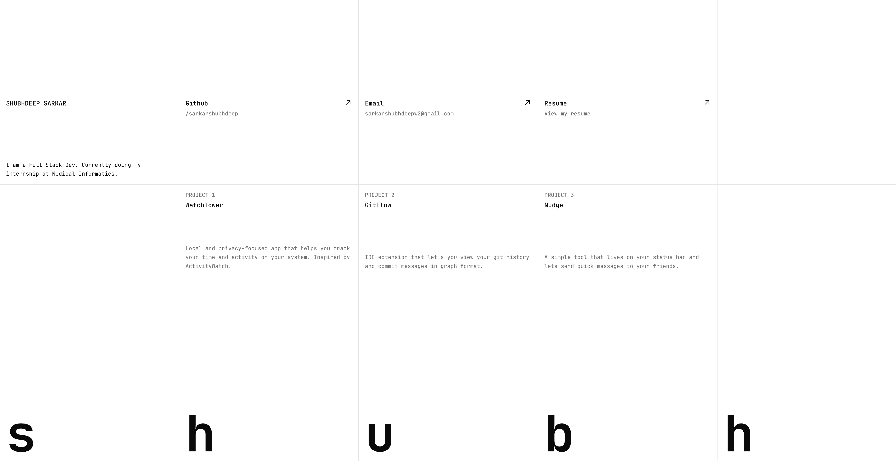

# Shubhdeep Sarkar's Portfolio

Personal portfolio site with a minimal grid layout: bio, links (GitHub, Email, Resume), and project highlights. Built with Next.js and Turborepo.

## Tech stack

- **Framework:** Next.js 16 (App Router)
- **UI:** React 19, Tailwind CSS v4
- **Animation:** Framer Motion
- **Icons:** Phosphor Icons
- **Monorepo:** Turborepo, npm workspaces
- **Language:** TypeScript

## Deployment checklist

- [ ] Choose a host (Vercel, Netlify, etc.)
- [ ] Connect the GitHub repo to the host
- [ ] Set build command: `npm run build`
- [ ] Set output directory: `apps/web` (or root if the host runs `npm run build` from repo root)
- [ ] Set install command: `npm install` (or default)
- [ ] Add environment variables if needed
- [ ] Deploy and verify the live URL
